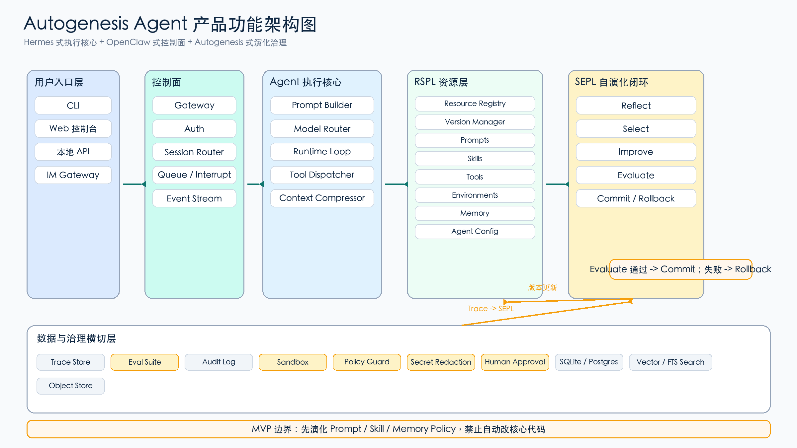

# Autogenesis Agent

Autogenesis Agent is a controlled self-evolving agent runtime based on the Autogenesis protocol idea: RSPL manages evolvable resources, and SEPL governs reflection, improvement, evaluation, commit, and rollback.

The project is currently in the Phase 1 startup stage. The goal is to build a stable execution foundation before enabling self-evolution.

## Product Direction

Autogenesis Agent combines three architecture ideas:

- Hermes-style execution core: one reusable agent runtime for CLI, API, cron, and future gateways.
- OpenClaw-style control plane: explicit gateway, session, queue, interrupt, and event boundaries.
- Autogenesis-style evolution governance: versioned resources, trace-driven improvement, evaluation gates, and rollback.

## Current Scope

Phase 1 focuses on the minimum runtime foundation:

- CLI entry point.
- Local API app factory.
- SQLite-backed session persistence.
- RSPL-style resource registry and version manager.
- Tool registry with permission levels.
- Trace store for runtime and tool-call observability.
- Deterministic runtime loop for local testing.

Phase 1 implementation lives on:

- [`feature/phase-1-runtime`](https://github.com/Axer-wyh/Autogenesis_Agent/tree/feature/phase-1-runtime)

## Documentation

- [Product plan](docs/product/autogenesis_agent_product_plan.md)
- [Architecture diagram](docs/product/autogenesis_agent_architecture.png)
- [Phase 1 implementation plan](docs/superpowers/plans/2026-06-09-phase-1-runtime.md)



## Local Commands

After checking out the Phase 1 branch:

```bash
python3 -m venv .venv
.venv/bin/python -m pip install -e '.[test]'
.venv/bin/python -m pytest -q
```

Run the deterministic CLI smoke test:

```bash
.venv/bin/python -m autogenesis_agent.cli "hello phase one" --db workdir/smoke.sqlite --workspace .
```

Expected output:

```text
hello phase one
```

## MVP Boundary

The first self-evolution target will be Prompt, Skill, Memory Policy, and Tool Routing Policy.

The MVP explicitly does not allow automatic modification of core runtime code, authentication logic, audit logic, or safety policy.
